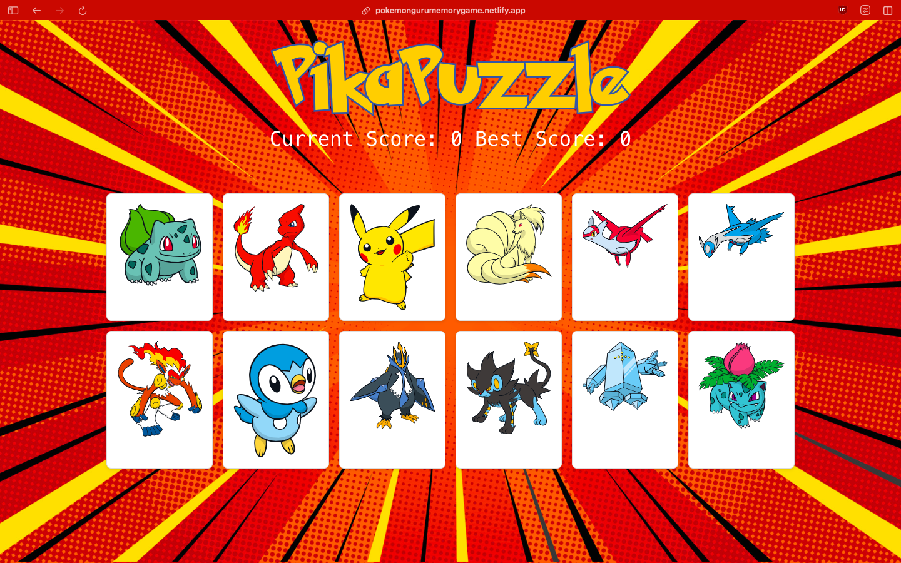

# Poke memory game

---

- Pokémon-themed card game designed to test your memory. The challenge is to click on each displayed card only once per round.
- Each successful click earns a point, after which the cards are shuffled.
- When you successfully click on all the cards in a round, you advance to the next round, which introduces a new random card set and adds two new cards to increase the difficulty.

---

# Screenshot



## Getting started

For starting this in your machine, open the terminal and follow these commands:

git clone the repo
```
git clone https://github.com/Vinay-Basargekar/Memory-game.git
```

install all the npm module used in the repo
```
npm install
```

run on your local
```
npm start
```